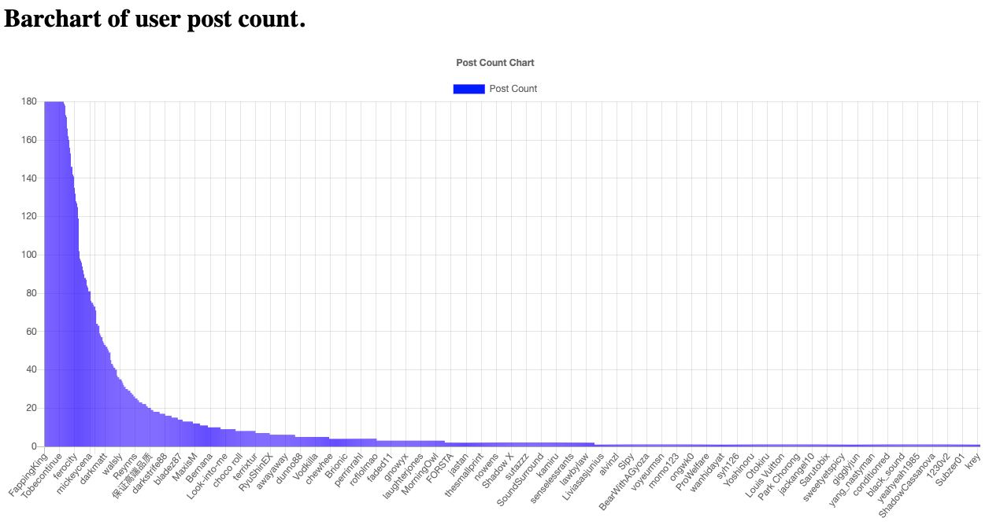

# Assignment 3

## Introduction

This assignment leverage on the scraper that was created in Assignment 1 and the Spark Streaming in Assignment 3 to generate a chart to list out the top users that post during the latest time period. This is then pushed into __MongoDB__ to be read by the __Django App__.


## Environment Setup

To run the program you will need the following installed on your host machine

1) Python 3 or later
2) Apache Kafka
3) Spark
4) MongoDB 5.0 


<br>

To install all the Python libraries required, run the following command
```
pip3 install -r requirements.txt
```

## Submitting the Spark Job

Run the following command to submit the spark job

```
>>> spark-submit --packages org.apache.spark:spark-sql-kafka-0-10_2.12:3.1.2,org.mongodb.spark:mongo-spark-connector_2.12:3.0.1  kafka_wordcount.py
```

## Running Django App

Run the following command to start the Django App
```
python3 manage.py runserver
```


## Result
